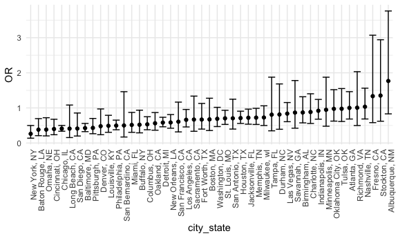
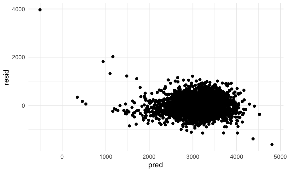
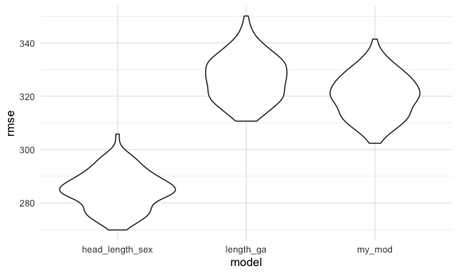
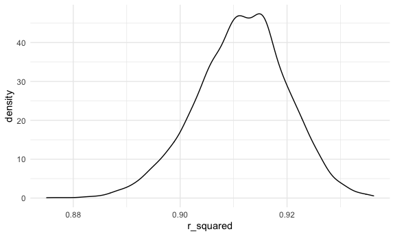
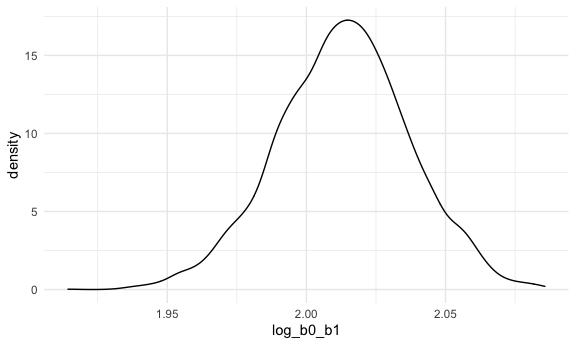

HW 6: Linear Models
================
Emma Gorin
December 2020

``` r
library(tidyverse)
```

    ## ── Attaching packages ──────────────────────────────────────────────────────────── tidyverse 1.3.0 ──

    ## ✓ ggplot2 3.3.2     ✓ purrr   0.3.4
    ## ✓ tibble  3.0.3     ✓ dplyr   1.0.2
    ## ✓ tidyr   1.1.2     ✓ stringr 1.4.0
    ## ✓ readr   1.3.1     ✓ forcats 0.5.0

    ## ── Conflicts ─────────────────────────────────────────────────────────────── tidyverse_conflicts() ──
    ## x dplyr::filter() masks stats::filter()
    ## x dplyr::lag()    masks stats::lag()

``` r
library(modelr)
library(p8105.datasets)

knitr::opts_chunk$set(
  fig.width = 6,
  fig.asp = .6,
  out.width = "90%"
)

theme_set(theme_minimal() + theme(legend.position = "bottom"))

options(
  ggplot2.continuous.colour = "viridis",
  ggplot2.continuous.fill = "viridis"
)
```

## Problem 1

The Washington Post has gathered data on homicides in 50 large U.S.
cities and made the data available through a GitHub repository here. You
can read their accompanying article here.

Create a city\_state variable (e.g. “Baltimore, MD”), and a binary
variable indicating whether the homicide is solved. Omit cities Dallas,
TX; Phoenix, AZ; and Kansas City, MO – these don’t report victim race.
Also omit Tulsa, AL – this is a data entry mistake. For this problem,
limit your analysis those for whom victim\_race is white or black. Be
sure that victim\_age is numeric.

``` r
homicide_df =
  read_csv("data/homicide-data.csv") %>% 
  mutate(
    city_state = str_c(city, state, sep = ", "),
    victim_age = as.numeric(victim_age),
    resolution = case_when(
      disposition == "Closed without arrest" ~ 0,
      disposition == "Open/No arrest"        ~ 0,
      disposition == "Closed by arrest"      ~ 1,
    )
  ) %>% 
  filter(city_state != "Tulsa, AL",
         victim_race %in% c("White", "Black")) %>% 
  select(city_state, resolution, victim_age, victim_race, victim_sex)
```

    ## Parsed with column specification:
    ## cols(
    ##   uid = col_character(),
    ##   reported_date = col_double(),
    ##   victim_last = col_character(),
    ##   victim_first = col_character(),
    ##   victim_race = col_character(),
    ##   victim_age = col_character(),
    ##   victim_sex = col_character(),
    ##   city = col_character(),
    ##   state = col_character(),
    ##   lat = col_double(),
    ##   lon = col_double(),
    ##   disposition = col_character()
    ## )

    ## Warning: Problem with `mutate()` input `victim_age`.
    ## ℹ NAs introduced by coercion
    ## ℹ Input `victim_age` is `as.numeric(victim_age)`.

    ## Warning in mask$eval_all_mutate(dots[[i]]): NAs introduced by coercion

For the city of Baltimore, MD, use the glm function to fit a logistic
regression with resolved vs unresolved as the outcome and victim age,
sex and race as predictors. Save the output of glm as an R object; apply
the broom::tidy to this object; and obtain the estimate and confidence
interval of the adjusted odds ratio for solving homicides comparing
non-white victims to white victims keeping all other variables fixed.

``` r
baltimore_df = 
  homicide_df %>% 
  filter(city_state == "Baltimore, MD")

glm(resolution ~ victim_age + victim_race + victim_sex,
    data = baltimore_df,
    family = binomial()) %>% 
  broom::tidy() %>% 
  mutate(
    OR = exp(estimate),
    CI_lower = exp(estimate - 1.96 * std.error),
    CI_upper = exp(estimate + 1.96 * std.error)
  ) %>% 
  select(term, OR, starts_with("CI")) %>% 
  knitr:: kable(digits = 3)
```

| term              |    OR | CI\_lower | CI\_upper |
| :---------------- | ----: | --------: | --------: |
| (Intercept)       | 1.363 |     0.975 |     1.907 |
| victim\_age       | 0.993 |     0.987 |     1.000 |
| victim\_raceWhite | 2.320 |     1.648 |     3.268 |
| victim\_sexMale   | 0.426 |     0.325 |     0.558 |

Now run glm for each of the cities in your dataset, and extract the
adjusted odds ratio (and CI) for solving homicides comparing Black
victims to white victims. Do this within a “tidy” pipeline, making use
of purrr::map, list columns, and unnest as necessary to create a
dataframe with estimated ORs and CIs for each city.

``` r
models_results_df = 
  homicide_df %>% 
  nest(data = -city_state) %>% 
  mutate(
    models = 
      map(.x = data, ~glm(resolution ~ victim_age + victim_race + victim_sex, data = .x, family = binomial())),
    results = map(models, broom::tidy)
  ) %>% 
  select(city_state, results) %>% 
  unnest(results) %>% 
  mutate(
    OR = exp(estimate),
    CI_lower = exp(estimate - 1.96 * std.error),
    CI_upper = exp(estimate + 1.96 * std.error)
  ) %>% 
  select(city_state, term, OR, starts_with("CI"))
```

Create a plot that shows the estimated ORs and CIs for each city.
Organize cities according to estimated OR, and comment on the plot.

``` r
models_results_df %>% 
  filter(term == "victim_sexMale") %>% 
  mutate(city_state = fct_reorder(city_state, OR)) %>% 
  ggplot(aes(x = city_state, y = OR)) +
  geom_point() +
  geom_errorbar(aes(ymin = CI_lower, ymax = CI_upper)) +
  theme(axis.text.x = element_text(angle = 90, hjust = 1))
```



In most cities, odds of homicide being resolved by arrest are lower in
male vs female victims.

## Problem 2

In this problem, you will analyze data gathered to understand the
effects of several variables on a child’s birthweight. This dataset,
available here, consists of roughly 4000 children and includes the
following variables:

babysex: baby’s sex (male = 1, female = 2) bhead: baby’s head
circumference at birth (centimeters) blength: baby’s length at birth
(centimeteres) bwt: baby’s birth weight (grams) delwt: mother’s weight
at delivery (pounds) fincome: family monthly income (in hundreds,
rounded) frace: father’s race (1 = White, 2 = Black, 3 = Asian, 4 =
Puerto Rican, 8 = Other, 9 = Unknown) gaweeks: gestational age in weeks
malform: presence of malformations that could affect weight (0 = absent,
1 = present) menarche: mother’s age at menarche (years) mheigth:
mother’s height (inches) momage: mother’s age at delivery (years)
mrace: mother’s race (1 = White, 2 = Black, 3 = Asian, 4 = Puerto Rican,
8 = Other) parity: number of live births prior to this pregnancy
pnumlbw: previous number of low birth weight babies pnumgsa: number of
prior small for gestational age babies ppbmi: mother’s pre-pregnancy BMI
ppwt: mother’s pre-pregnancy weight (pounds) smoken: average number of
cigarettes smoked per day during pregnancy wtgain: mother’s weight gain
during pregnancy (pounds)

Load and clean the data for regression analysis (i.e. convert numeric to
factor where appropriate, check for missing data, etc.).

``` r
birthweight_df =
  read_csv("./data/birthweight.csv") %>% 
  mutate(
    baby_sex = recode(babysex, `1` = "male", `2` = "female")
  ) %>% 
  rename(
    ga_weeks = gaweeks,
    baby_length_cm = blength,
    baby_head_cm = bhead,
    baby_weight_g = bwt,
    mom_age = momage,
    mom_weight_lb = delwt,
    smoke_n = smoken
  ) %>% 
  select(baby_weight_g, baby_length_cm, ga_weeks, baby_head_cm, baby_sex, mom_age, mom_weight_lb, smoke_n) # to add: anything I use for a model
```

    ## Parsed with column specification:
    ## cols(
    ##   .default = col_double()
    ## )

    ## See spec(...) for full column specifications.

Propose a regression model for birthweight. This model may be based on a
hypothesized structure for the factors that underly birthweight, on a
data-driven model-building process, or a combination of the two.
Describe your modeling process and show a plot of model residuals
against fitted values – use add\_predictions and add\_residuals in
making this plot.

**I was curious about the potential association between maternal smoking
and birthweight. In addition to smoking, I decided to include maternal
age and maternal weight in the model, which I think could be potential
confounders. I also included gestational age and length at birth, since
I was curious if maternal smoking would be associated with low birth
weight even after adjusting for these factors.**

``` r
my_mod = lm(baby_weight_g ~ mom_age + mom_weight_lb + ga_weeks + baby_length_cm + smoke_n, data = birthweight_df)
birthweight_df %>% 
  modelr::add_residuals(my_mod) %>% 
  modelr::add_predictions(my_mod) %>% 
  ggplot(aes(x = pred, y = resid)) +
  geom_point()
```



**As you can see in the plot above, there is one baby with a predicted
birthweight of \< 0. I investigate this further below.**

``` r
birthweight_df %>% 
  modelr::add_residuals(my_mod) %>% 
  modelr::add_predictions(my_mod) %>% 
  filter(pred < 1000) %>% 
  head()
```

    ## # A tibble: 5 x 10
    ##   baby_weight_g baby_length_cm ga_weeks baby_head_cm baby_sex mom_age
    ##           <dbl>          <dbl>    <dbl>        <dbl> <chr>      <dbl>
    ## 1          3459             20     38.7           35 male          22
    ## 2          2750             32     37.4           33 female        23
    ## 3           595             32     27             21 female        20
    ## 4           624             33     20.1           23 male          18
    ## 5           680             31     25.7           22 female        16
    ## # … with 4 more variables: mom_weight_lb <dbl>, smoke_n <dbl>, resid <dbl>,
    ## #   pred <dbl>

**It turns out this particular baby’s length in cm is listed as 20 -
which seems implausible based on its gestational age. I decided to
remove this observation from the dataset for the rest of the problem.**

``` r
birthweight_df = 
  birthweight_df %>% 
  filter(baby_length_cm > 20)
```

Compare your model to two others:

One using length at birth and gestational age as predictors (main
effects only) One using head circumference, length, sex, and all
interactions (including the three-way interaction) between these Make
this comparison in terms of the cross-validated prediction error; use
crossv\_mc and functions in purrr as appropriate.

``` r
cv_df = 
  crossv_mc(birthweight_df, 100) %>%
  mutate(
    length_ga_mod = map(train, ~lm(baby_weight_g ~ baby_length_cm + ga_weeks, data = .x)),
    head_length_sex_mod = map(train, ~lm(baby_weight_g ~ baby_head_cm * baby_length_cm * baby_sex, data = .x)),
    my_mod = map(train, ~lm(baby_weight_g ~ mom_age + mom_weight_lb + ga_weeks + baby_length_cm + smoke_n, data = .x))
    ) %>% 
  mutate(
    rmse_length_ga = map2_dbl(.x = length_ga_mod, .y = test, ~rmse(model = .x, data = .y)),
    rmse_head_length_sex = map2_dbl(.x = head_length_sex_mod, .y = test, ~rmse(model = .x, data = .y)),
    rmse_my_mod = map2_dbl(.x = my_mod, .y = test, ~rmse(model = .x, data = .y))
  )
```

As we did in class, let’s compare the models:

``` r
cv_df %>% 
  select(starts_with("rmse")) %>% 
  pivot_longer(
    everything(),
    names_to = "model",
    values_to = "rmse",
    names_prefix = "rmse_"
  ) %>% 
  ggplot(aes(x = model, y = rmse)) +
  geom_violin()
```



**It looks like the model including length, head circumference, and all
of the interaction terms best predicts birthweight. Compared to the
model including just length and gestational age, the model including
these variables as well as maternal smoking, maternal weight and
maternal age is better able to predict birthweight**

Note that although we expect your model to be reasonable, model building
itself is not a main idea of the course and we don’t necessarily expect
your model to be “optimal”.

## Problem 3

For this problem, we’ll use the 2017 Central Park weather data that
we’ve seen elsewhere. The code chunk below (adapted from the course
website) will download these data.

``` r
weather_df = 
  rnoaa::meteo_pull_monitors(
    c("USW00094728"),
    var = c("PRCP", "TMIN", "TMAX"), 
    date_min = "2017-01-01",
    date_max = "2017-12-31") %>%
  mutate(
    name = recode(id, USW00094728 = "CentralPark_NY"),
    tmin = tmin / 10,
    tmax = tmax / 10) %>%
  select(name, id, everything())
```

    ## Registered S3 method overwritten by 'hoardr':
    ##   method           from
    ##   print.cache_info httr

    ## using cached file: /Users/Emma/Library/Caches/R/noaa_ghcnd/USW00094728.dly

    ## date created (size, mb): 2020-10-02 17:31:34 (7.52)

    ## file min/max dates: 1869-01-01 / 2020-09-30

The bootstrap is helpful when you’d like to perform inference for a
parameter / value / summary that doesn’t have an easy-to-write-down
distribution in the usual repeated sampling framework. We’ll focus on a
simple linear regression with tmax as the response and tmin as the
predictor, and are interested in the distribution of two quantities
estimated from these data:

Try it for one regression:

``` r
lm(tmax ~ tmin, data = weather_df) %>% 
  broom::glance()
```

    ## # A tibble: 1 x 12
    ##   r.squared adj.r.squared sigma statistic   p.value    df logLik   AIC   BIC
    ##       <dbl>         <dbl> <dbl>     <dbl>     <dbl> <dbl>  <dbl> <dbl> <dbl>
    ## 1     0.912         0.911  2.94     3741. 2.98e-193     1  -910. 1827. 1838.
    ## # … with 3 more variables: deviance <dbl>, df.residual <int>, nobs <int>

``` r
lm(tmax ~ tmin, data = weather_df) %>% 
  broom::tidy()
```

    ## # A tibble: 2 x 5
    ##   term        estimate std.error statistic   p.value
    ##   <chr>          <dbl>     <dbl>     <dbl>     <dbl>
    ## 1 (Intercept)     7.21    0.226       31.8 3.81e-107
    ## 2 tmin            1.04    0.0170      61.2 2.98e-193

r̂ 2 log(β̂ 0∗β̂ 1) Use 5000 bootstrap samples and, for each bootstrap
sample, produce estimates of these two quantities.

``` r
bootstrap_results_df = 
  weather_df %>% 
  bootstrap(5000, id = "strap_number") %>% 
  mutate(
    models = map(.x = strap, ~lm(tmax ~ tmin, data = .x)),
    res_broom_tidy = map(models, broom::tidy),
    res_broom_glance = map(models, broom::glance)
  ) %>% 
  select(strap_number, res_broom_tidy, res_broom_glance) %>% 
  unnest(res_broom_tidy) %>% 
  select(strap_number, term, estimate, res_broom_glance) %>% 
  pivot_wider(names_from = term, values_from = estimate) %>% 
  janitor::clean_names() %>% 
  mutate(log_b0_b1 = log(intercept * tmin)) %>% 
  unnest(res_broom_glance) %>% 
  select(strap_number, log_b0_b1, r.squared) %>% 
  janitor::clean_names()
```

Plot the distribution of your estimates, and describe these in words.

``` r
bootstrap_results_df %>% 
  ggplot(aes(x = r_squared)) +
  geom_density()
```



``` r
bootstrap_results_df %>% 
  ggplot(aes(x = log_b0_b1)) +
  geom_density()
```



**Both the density plot of r squared and the density plot of log(β̂
0∗β̂1)show a roughly normal distribuion. R squared appears to have a
mean of around .913 while log(β̂ 0∗β̂ 1) appears to have a mean of
around 2.02. (At least during my first run that’s what we see.)**

Using the 5000 bootstrap estimates, identify the 2.5% and 97.5%
quantiles to provide a 95% confidence interval for r̂ 2 and log(β̂ 0∗β̂
1).

``` r
bootstrap_results_df %>% 
  pivot_longer(cols = r_squared:log_b0_b1, names_to = "term", values_to = "estimate") %>% 
  group_by(term) %>% 
  summarize(
    ci_lower = quantile(estimate, 0.025),
    ci_upper = quantile(estimate, 0.975)
  )
```

    ## `summarise()` ungrouping output (override with `.groups` argument)

    ## # A tibble: 2 x 3
    ##   term      ci_lower ci_upper
    ##   <chr>        <dbl>    <dbl>
    ## 1 log_b0_b1    1.97     2.06 
    ## 2 r_squared    0.894    0.927

Note: broom::glance() is helpful for extracting r̂ 2 from a fitted
regression, and broom::tidy() (with some additional wrangling) should
help in computing log(β̂ 0∗β̂ 1).
